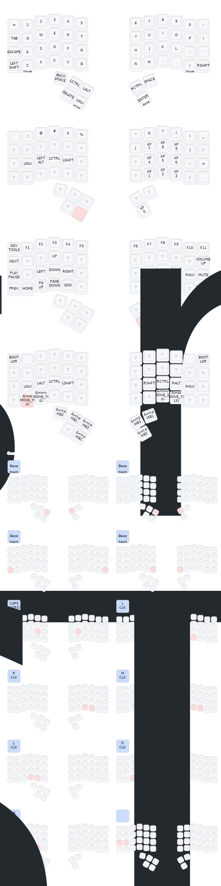

## Intro

This repository forked from [charybdis-wireless-mini-zmk-firmware](https://github.com/280Zo/charybdis-wireless-mini-zmk-firmware/tree/main). This configuration adapted for [Charybdis 4x6 version](https://bastardkb.com/product/charybdis-mk2-prebuilt-preorder/)

## Usage

If you'd like to use the pre-built firmware the files can be found in the [Actions Workflows](https://github.com/LudwigAndreas/charybdis_zmk/actions?query=is%3Acompleted+branch%3Amain). To download them, log into Github, click the link, select the latest run that passed on the main branch, and download the applicable firmware. There are five firmware artifacts to choose from. If you're unsure which one to use, you probably want the firmware-charybdis-qwerty build.

- **firmware-charybdis-qwerty** - Bluetooth/USB with QWERTY layout
- **firmware-reset-nanov2** - Reset the firmware completely

## Flashing the Firmware

Follow the steps below to flash the firmware

- If you are flashing the firmware for the first time, or if you're switching between the dongle and the Bluetooth/USB configuration, flash the reset firmware to all the devices first
- Unzip the firmware.zip
- Plug the right half info the computer through USB
- Double press the reset button
- The keyboard will mount as a removable storage device
- Copy the applicable uf2 file into the NICENANO storage device (e.g. charybdis_qwerty_dongle.uf2 -> dongle)
- It will take a few seconds, then it will unmount and restart itself.
- Repeat these steps for all devices.
- You should now be able to use your keyboard

> [!NOTE]  
> If the keyboard halves aren't connecting as expected, try pressing the reset button on both halves at the same time. If that doesn't work, follow the [ZMK Connection Issues](https://zmk.dev/docs/troubleshooting/connection-issues#acquiring-a-reset-uf2) documentation for more troubleshooting steps.

## Keymaps & Layers

Mostly keymaps was taken from [default Bastard keybaords keymap for charybdis v2](https://docs.bastardkb.com/fw/default-keymaps.html) but with changed thumb clusters.

## Credits

- [280Zo](https://github.com/280Zo/charybdis-wireless-mini-zmk-firmware)
- [caksoylar](https://github.com/caksoylar/zmk-config)
- [eigatech](https://github.com/eigatech)
- [badjeff](https://github.com/badjeff)
- [inorichi](https://github.com/inorichi)
- [manna-harbour](https://github.com/manna-harbour)
- [nickcoutsos](https://github.com/nickcoutsos/keymap-editor)
- [Petejohanson](https://github.com/petejohanson)
- [caksoylar](https://github.com/caksoylar/keymap-drawer)
